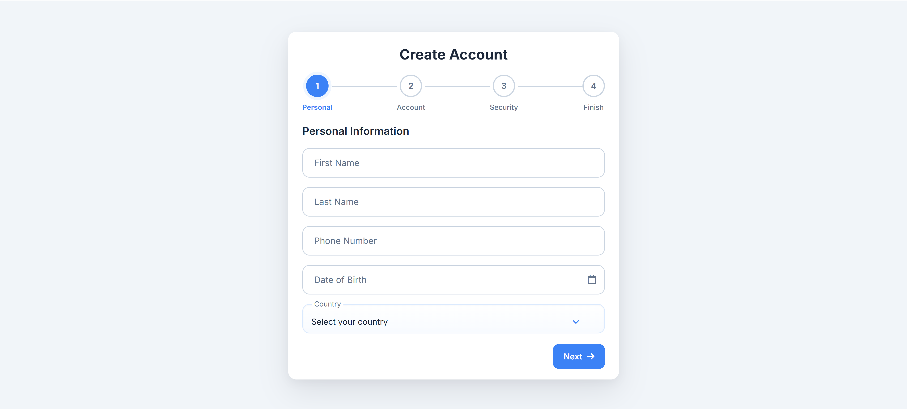

# 📝 Multi-Step Registration Form

A modern and responsive multi-step registration form built with HTML, CSS, and JavaScript.

This project focuses on creating a smooth user registration experience with step-by-step navigation, input validation, password security checks, and a clean modern interface.

---

## 🚀 Demo

[(Live Demo of Multi Registration form)](https://saeed-motevalli.github.io/multi-step-registration-form/)

---

# 📸 Screenshots

## Desktop View

<p align="center">
  
</p>

# 📌 About The Project

This project was created to practice building interactive frontend interfaces without using external frameworks.

The main goal was to create a realistic registration flow similar to modern web applications, focusing on:

- Clean UI design
- User-friendly form experience
- Form validation
- Interactive components
- Responsive layouts
- JavaScript DOM manipulation

---

# ✨ Features

## 🔄 Multi-Step Registration

The registration process is divided into multiple steps:

### Step 1 - Personal Information

- First name
- Last name
- Phone number
- Date of birth
- Country selection

### Step 2 - Account Information

- Email validation
- Username input

### Step 3 - Security

- Password creation
- Password confirmation
- Password visibility toggle
- Password strength indicator
- Password rules validation

### Step 4 - Confirmation

- Review entered information
- Edit previous steps
- Final account creation simulation

---

# 🔐 Form Validation

The project includes client-side validation for:

- Required fields
- Email format
- Password requirements
- Password confirmation matching

Password requirements include:

- Minimum 8 characters
- Uppercase letter
- Lowercase letter
- Number
- Special character

---

# 🎨 UI Features

- Modern card-based design
- Progress step indicator
- Animated step transitions
- Floating input labels
- Custom dropdown component
- Loading state
- Success confirmation screen

---

# 📅 Persian Calendar

The project includes a custom Jalali date picker:

- Persian calendar support
- Month navigation
- Year selection
- Persian date display

---

# 📱 Responsive Design

The form is designed to work across different screen sizes:

- Desktop
- Tablet
- Mobile devices

The layout automatically adapts for a better user experience.

---

# 🛠 Technologies Used

- HTML5
- CSS3
- JavaScript (ES6)
- DOM Manipulation
- Font Awesome
- Google Fonts

---

# 📂 Project Structure

```
multi-registration-form/

│
├── index.html
├── style.css
├── script.js
│
├── assets/
│   └── favicon/
│       └── Blue.webp
│
└── README.md
```

---

# 🎯 Learning Goals

Through this project, I practiced:

- Building complex forms with vanilla JavaScript
- Managing UI states
- Creating reusable validation functions
- Improving frontend user experience
- Writing clean and organized CSS
- Developing responsive interfaces

---

# 👨‍💻 Author

## Saeed Motevalli

Front-End Developer

GitHub:
https://github.com/Saeed-Motevalli
